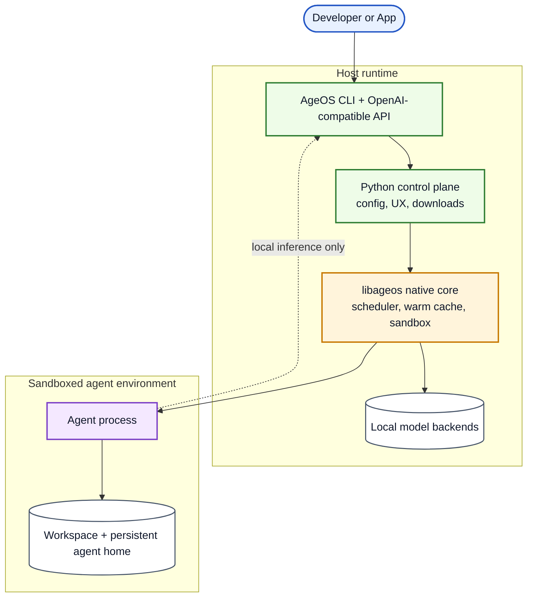

# AgeOS Architecture

AgeOS is innovative because it combines three things in one runtime:

1. local LLM serving,
2. shared warm-model orchestration, and
3. sandboxed agents that can still use local inference safely.

## High-level diagram

## Why this is different

- **One entrypoint, multiple surfaces**: the CLI, SDK-style flows, and OpenAI-compatible endpoint all converge on the same runtime.
- **Warm local models**: model backends stay reusable across prompts and agent runs instead of being restarted for every request.
- **Native sandboxing**: agents run with restricted filesystem and network access while still getting access to the local inference endpoint.
- **Clear separation of roles**: Python handles user-facing orchestration, while `libageos` owns scheduling, model lifecycle, and sandbox enforcement.
