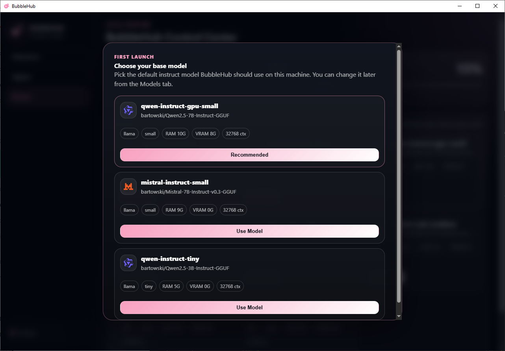

# Getting Started with BubbleHub

BubbleHub is a local LLM serving and sandboxed-agent runtime in one command. It runs language models on your own hardware, wraps every agent in a Linux sandbox, and exposes an OpenAI-compatible endpoint so you can connect any Python agent or tool without changes to your inference code.

This guide walks you through installation, opening the Control Center, and running your first agent with the Python shim.

---

## Requirements

| Requirement | Notes |
|---|---|
| **OS** | Linux (Ubuntu 22.04+ recommended) or Windows via WSL 2 |
| **RAM** | 8 GB minimum; 16 GB+ recommended for larger models |
| **Disk** | 10 GB free for the runtime and a base model |
| **Python** | 3.10 or later (for the Python shim examples) |

---

## Installation

### Linux

Open a terminal and run:

```bash
curl -fsSL https://bubblehub.ai/install.sh | bash
```

The installer downloads the BubbleHub binary, installs the native sandbox helper with the required permissions, and creates the Ubuntu 26.04 base rootfs that agents run inside.

When it finishes, verify the install:

```bash
bubble --help
```

### Windows (via WSL 2)

BubbleHub runs inside WSL 2. Open PowerShell and run:

```powershell
irm https://bubblehub.ai/install.ps1 | iex
```

The script checks that WSL 2 is ready, then runs the Linux installer inside your Ubuntu distro. If WSL is not yet installed, follow the prompt to run `wsl --install -d Ubuntu` first, finish Ubuntu setup, then rerun the command.

### Docker

Pull the latest image:

```bash
docker pull ghcr.io/bublhub/bubblehub:latest
```

Or pin a specific release:

```bash
docker pull ghcr.io/bublhub/bubblehub:v0.1.0
```

Use the image as a base in your own Dockerfile:

```dockerfile
FROM ghcr.io/bublhub/bubblehub:v0.1.0
```

### Install a Specific Version

```bash
curl -fsSL https://bubblehub.ai/download/linux/v0.1.0/install.sh | BUBBLEHUB_VERSION=v0.1.0 bash
```

Or download the Debian package directly:

```bash
curl -LO https://bubblehub.ai/download/linux/v0.1.0/BubbleHub-0.1.0-x64.deb
sudo apt install ./BubbleHub-0.1.0-x64.deb
```

---

## Opening the Control Center

The BubbleHub Control Center is a desktop app for monitoring running agents, managing model selection, and reviewing sandbox access manifests.

```bash
bubblehub
```


On first launch, BubbleHub shows an onboarding dialog so you can choose your base instruct model. Select the model that fits your hardware (smaller models need less RAM/VRAM), then click **Confirm**.



The Control Center has three tabs:

| Tab | What it shows |
|---|---|
| **Resources** | Live RAM and VRAM meters, loaded models, and the inference queue |
| **Agents** | All running agents, pending network-access requests, and per-agent sandbox manifests |
| **Models** | Full model catalog — click a model to make it the default |

---

## Your First Prompt

Before writing an agent, confirm BubbleHub can reach the local model:

```bash
bubble prompt --text "Say hello from BubbleHub"
```

You should see a short reply from the model printed to your terminal.

---

## Running Your First Agent — Python Shim

The Python shim (`BubbleHubOpenAI`) is a drop-in replacement for the OpenAI Python client. It routes `chat.completions.create` calls to the locally running model instead of the OpenAI API.

### 1. Create a working directory

```bash
mkdir my-first-agent
cd my-first-agent
```

### 2. Write the agent script

Create a file called `agent.py`:

```python
#!/usr/bin/env python3
from __future__ import annotations

import os
from bubblehub.integrations.openai_shim import BubbleHubOpenAI

def main() -> int:
    client = BubbleHubOpenAI()
    response = client.chat.completions.create(
        model="bubblehub-local",
        messages=[
            {
                "role": "user",
                "content": "Introduce yourself in one sentence.",
            }
        ],
    )
    print(response.choices[0].message.content.strip())
    return 0

if __name__ == "__main__":
    raise SystemExit(main())
```

`BubbleHubOpenAI` works identically to `openai.OpenAI()`. Inside the sandbox, BubbleHub automatically points it at the local inference endpoint — no API key or base URL required.

### 3. Run the agent inside the sandbox

```bash
bubble run \
  --root-dir . \
  --binary ./agent.py \
  --memory 4G
```

BubbleHub:

1. Starts the local inference endpoint if it is not already running.
2. Creates a Linux sandbox with a private filesystem and no general network access.
3. Injects `OPENAI_BASE_URL`, `OPENAI_API_KEY`, and `BUBBLEHUB_SANDBOX=1` into the agent environment.
4. Runs `agent.py` inside the sandbox.

You should see the model's one-sentence introduction printed to your terminal.

### Environment variables injected into every agent

| Variable | Value |
|---|---|
| `OPENAI_BASE_URL` | `http://127.0.0.1:8000/v1` |
| `OPENAI_API_KEY` | `bubblehub-local` |
| `BUBBLEHUB_API_BASE_URL` | `http://127.0.0.1:8000` |
| `BUBBLEHUB_SANDBOX` | `1` |
| `BUBBLEHUB_AGENT_ID` | Unique agent identifier |

---

## Useful CLI Commands

```bash
# Ask the local model a one-off question
bubble prompt --text "What is the capital of France?"

# List running agents and model status
bubble ps

# Open a sandboxed interactive shell
bubble shell --root-dir ./workspace

# Start the OpenAI-compatible HTTP endpoint for external tools
bubble serve

# List available models
bubble models list

# Open the dashboard to review pending network-access requests
bubble dashboard
```

---

## Developer Setup

This section is for contributors who want to build BubbleHub from source or run the test suite locally.

### 1. Clone the repository

```bash
git clone https://github.com/bublhub/BubbleHub.git
cd BubbleHub
```

### 2. Create a virtual environment

```bash
python3 -m venv .venv
source .venv/bin/activate
```

### 3. Install dependencies and build

```bash
./scripts/install-deps.sh
./scripts/build.sh
```

The build script:
- Compiles `libbubble` (the native sandbox and scheduler library).
- Installs `bubblehub-sandbox` under `/usr/local/bin` with setuid root permissions.
- Creates the Ubuntu 26.04 base rootfs on first run (preserved on later rebuilds for a faster loop).

### 4. Install the Python package in editable mode

```bash
pip install -e '.[dev]'
pre-commit install
```

`pre-commit install` enables the repository's lint hooks to run on every commit. Run them manually at any time:

```bash
pre-commit run --all-files
```

### 5. Run the unit tests

```bash
docker build -f docker/Dockerfile --target unit-test -t bubblehub:unit .
docker run --rm --privileged --security-opt seccomp=unconfined bubblehub:unit
```

### 6. Run the integration tests

Integration tests need persistent model and OpenClaw caches. Use named Docker volumes:

```bash
docker volume create bubblehub-cache-local
docker volume create bubblehub-openclaw-local

docker build -f docker/Dockerfile --target integration-test -t bubblehub:integration .
docker run --rm --privileged --security-opt seccomp=unconfined \
  -v bubblehub-cache-local:/cache/bubblehub \
  -v bubblehub-openclaw-local:/cache/openclaw \
  bubblehub:integration
```

### Writing a new agent

Agents are plain Python scripts (or any binary) that read the injected environment variables to reach the local model. The simplest pattern:

```python
from bubblehub.integrations.openai_shim import BubbleHubOpenAI

client = BubbleHubOpenAI()
# Use client.chat.completions.create() just like openai.OpenAI()
```

Other available shims:

| Shim | Import |
|---|---|
| OpenAI-compatible | `bubblehub.integrations.openai_shim.BubbleHubOpenAI` |
| Anthropic-compatible | `bubblehub.integrations.anthropic_shim` |
| LangChain | `bubblehub.integrations.langchain` |

See the `examples/` directory for runnable examples including the basic agent (`examples/basic/basic_agent.py`) and an MCP agent (`examples/mcp_agent/`).

---

## Next Steps

- **Run an existing agent in the sandbox** → see [Running an Agent](running_an_agent.md)
- **Sandbox internals and security model** → see [Sandbox Architecture](sandbox.md)
- **Python layer architecture** → see [Python Layer](python_layer.md)
- **Contributing** → see [CONTRIBUTING.md](../CONTRIBUTING.md)
