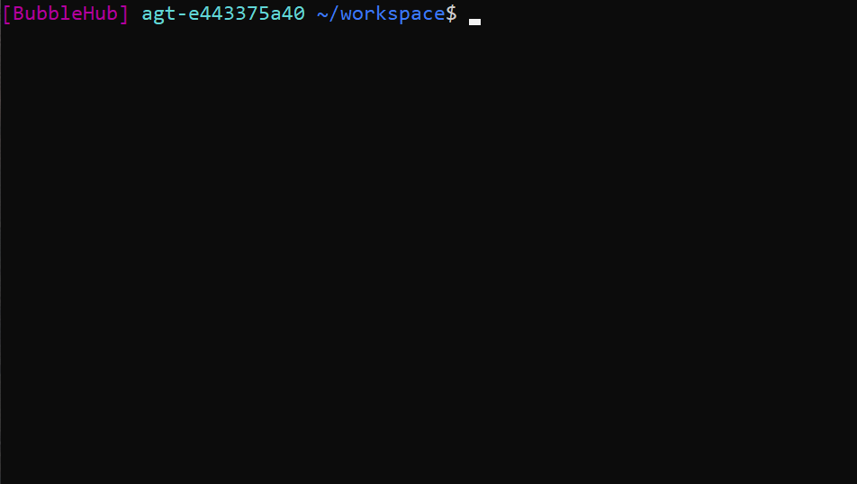
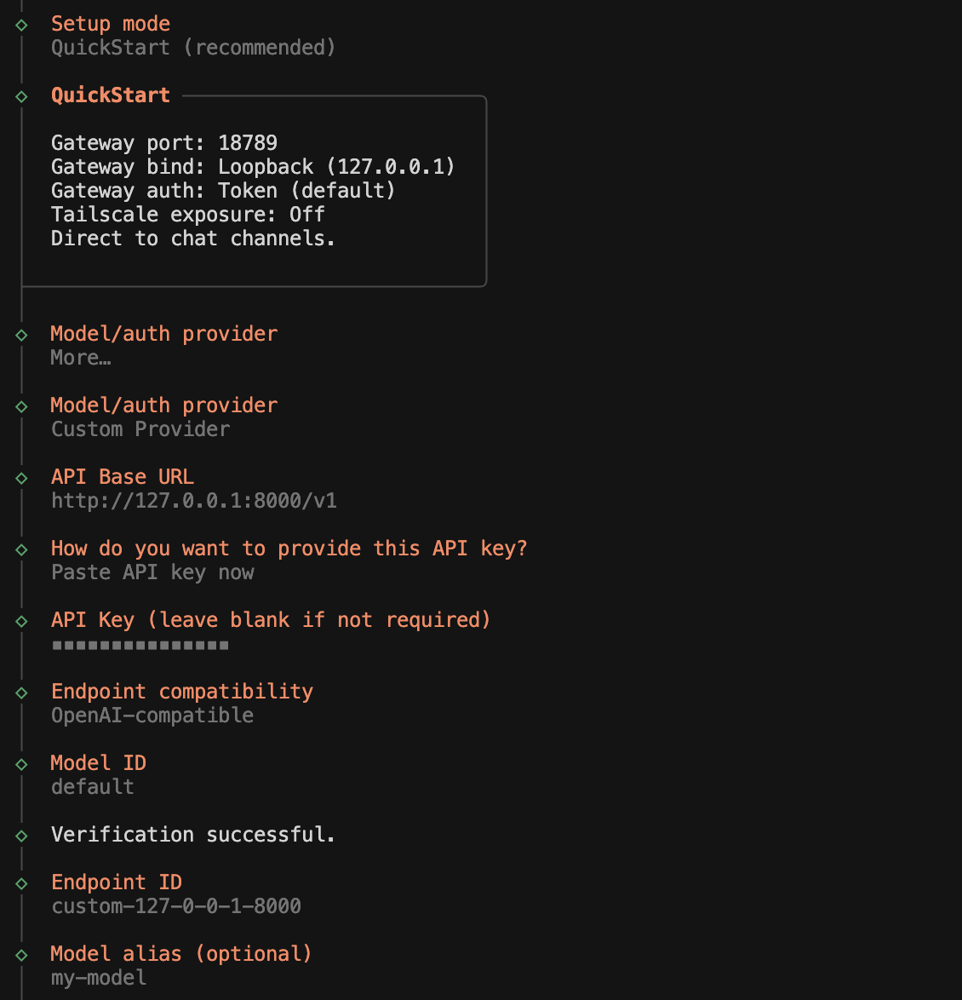
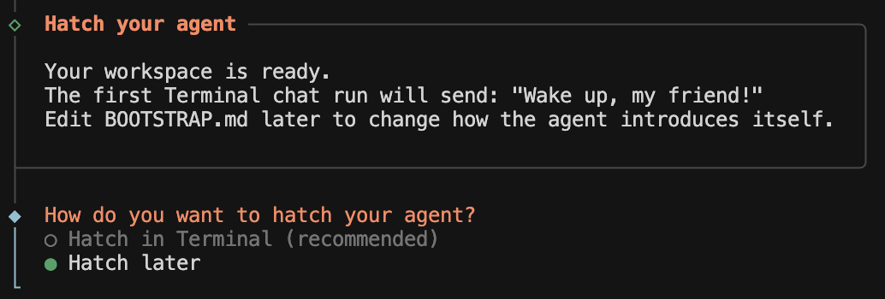
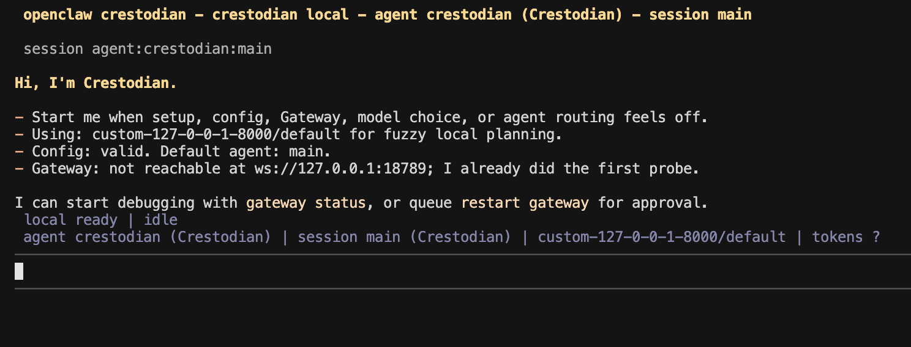
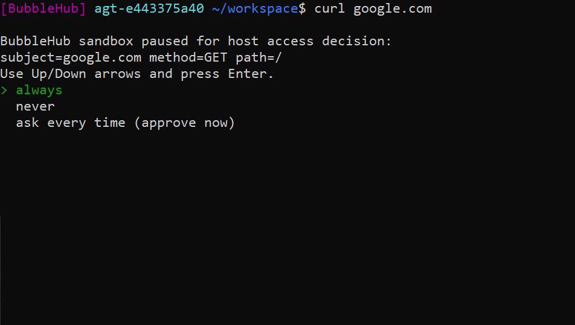
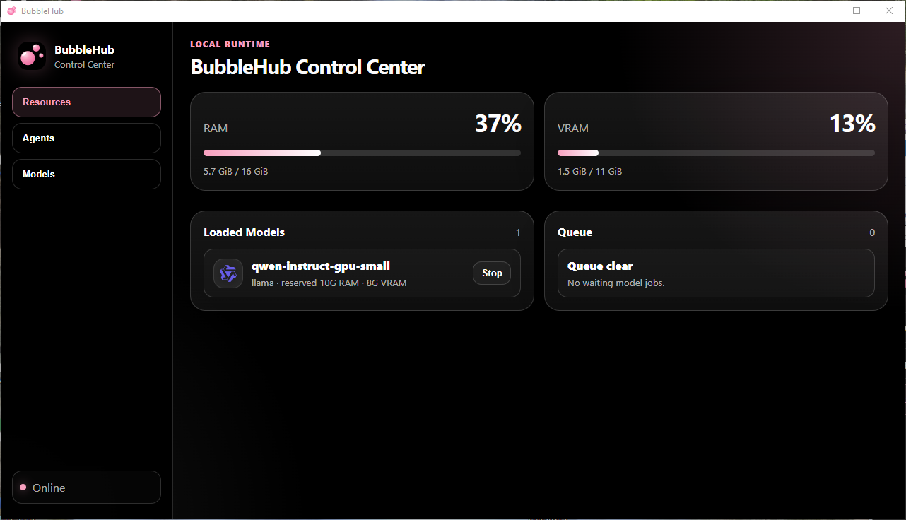
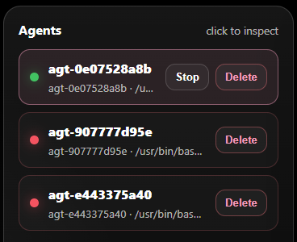
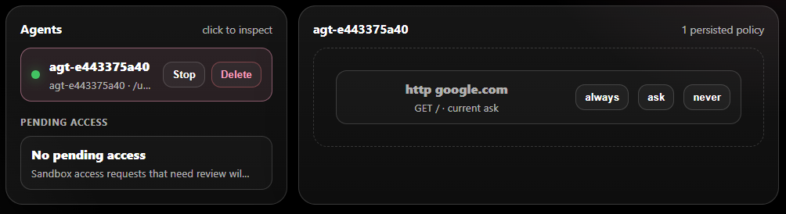
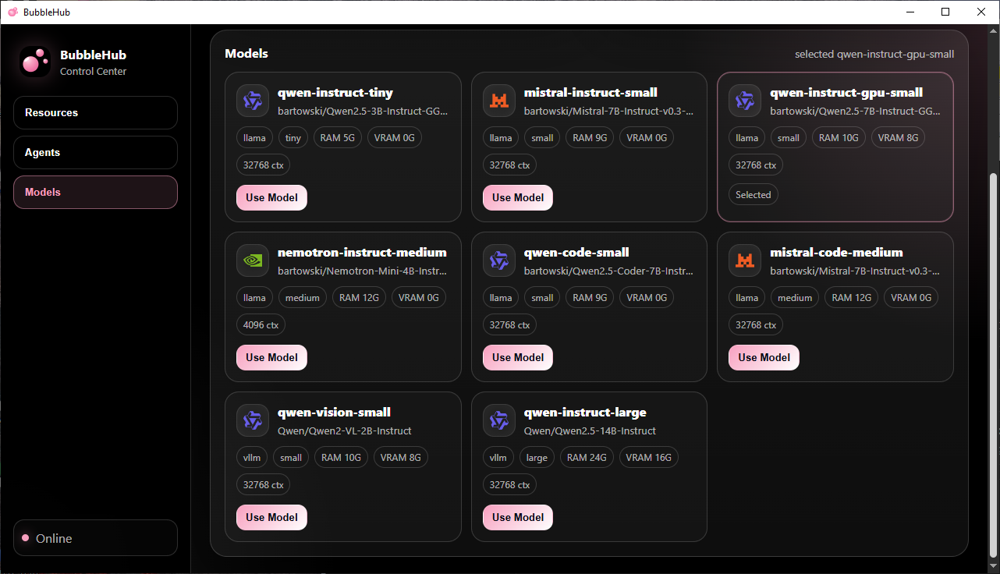

# Running an Agent in the Sandbox

This guide explains how to run an existing agent inside BubbleHub's sandbox, using **OpenClaw** as a concrete end-to-end example. By the end, you will have OpenClaw installed and running entirely inside an isolated sandbox, with the BubbleHub Control Center monitoring it in real time.

If you have not installed BubbleHub yet, start with [Getting Started](getting_started.md).

---

## What Is the BubbleHub Sandbox?

Every agent started with `bubble run` or `bubble shell` runs inside a Linux sandbox built from kernel primitives:

- **Private filesystem** — the agent sees only its workspace and a read-only system layer. Host files outside the workspace are not visible.
- **Non-root identity** — the agent process runs as an unprivileged per-agent UID, never as root.
- **Network isolation** — by default, the agent has no general outbound network access. HTTP calls go through a policy proxy that checks the agent's sandbox manifest before forwarding.
- **Resource limits** — memory, CPU, and process niceness are enforced by cgroups.

The workspace persists between runs. An agent's home directory and any files it writes outside the workspace are stored in a per-agent overlay, so nvm installations, npm packages, and config files survive restarts.

See [Sandbox Architecture](sandbox.md) for the full engineering reference.

---

## Overview of the Flow

```
bubble shell --allow-network --root-dir openclaw
  └─ sandbox starts with host network access
       └─ install nvm, Node.js, OpenClaw
  └─ openclaw onboard --install-daemon
bubble shell --root-dir openclaw   (subsequent runs)
  └─ sandbox starts with network isolation (default)
       └─ OpenClaw runs with cached install
```

The first run uses `--allow-network` so OpenClaw can download its dependencies. Subsequent runs use the default isolated mode — OpenClaw reads its persisted config and talks only to the local BubbleHub inference endpoint.

---

## Step-by-Step: Running OpenClaw

### Step 1 — Create a workspace directory

```bash
mkdir openclaw
```

BubbleHub uses `--root-dir` as the boundary for what the agent can write. Create this directory wherever you keep your projects.

### Step 2 — Open the sandbox shell with network access

```bash
bubble shell --allow-network --root-dir openclaw
```

`--allow-network` lets the sandbox share the host's network interfaces. This is needed only for the initial installation. BubbleHub still applies filesystem isolation and the non-root identity.

You will see a sandbox shell prompt. Your terminal is now inside the sandbox.



### Step 3 — Install nvm

Inside the sandbox shell:

```bash
curl -fsSL https://raw.githubusercontent.com/nvm-sh/nvm/v0.40.5/install.sh | bash
```

nvm installs into `~/.nvm` inside the sandbox home directory. This directory is part of the persistent per-agent overlay, so it will still be there the next time you open this sandbox.

### Step 4 — Activate nvm and install Node.js

```bash
export NVM_DIR="$HOME/.nvm"
. "$NVM_DIR/nvm.sh"
nvm install 22.19.0
```

Node.js is installed into `~/.nvm/versions/node/v22.19.0`. Because the sandbox home persists, you only need to run this once.

### Step 5 — Install OpenClaw

```bash
npm install -g openclaw@latest
```

This installs the `openclaw` command into the sandbox's npm global prefix (inside `~/.nvm`). Again, this persists across runs.

### Step 6 — Run the OpenClaw onboarding

```bash
openclaw onboard --install-daemon
```

OpenClaw's onboarding creates its config directory and registers its background daemon. When it asks for a model or auth provider, choose **More...**, then **Custom Provider**, and enter the local BubbleHub endpoint values:

```text
API Base URL: http://127.0.0.1:8000/v1
API key: bubblehub-local
Endpoint compatibility: OpenAI-compatible
Model ID: default
```



Continue through the remaining setup prompts. When OpenClaw asks how to finish the setup, choose **Hatch later**.



Press `Ctrl-D` or type `exit` when you are ready to leave the setup shell.

### Step 7 — Start using OpenClaw

After the initial install, you no longer need `--allow-network`. Re-enter the sandbox in the default isolated mode:

```bash
bubble shell --root-dir openclaw
```

Then start OpenClaw from inside the sandbox shell:

```bash
openclaw
```



nvm, Node.js, and OpenClaw are all in the persistent agent home and will be available immediately. OpenClaw's outbound traffic will be checked against its saved manifest. Requests to hosts you previously approved are forwarded; everything else is blocked.

If OpenClaw or any other sandboxed agent tries to reach a new network host, BubbleHub pauses the request and shows an access prompt in the terminal:



Enter `always`, `never`, or press **Enter** to approve just this once. Your decision is saved in the agent's sandbox manifest and applied automatically on future runs.

---

## Monitoring with the BubbleHub Control Center

Open the Control Center in a separate terminal:

```bash
bubblehub
```

### Resources Tab

The **Resources** tab shows live RAM and VRAM usage and the current inference queue.



- **RAM / VRAM meters** — hover to see exact used/total values.
- **Loaded Models** — models currently held in memory by the scheduler.
- **Queue** — pending inference requests. Each entry shows the requesting agent and the model specialty.

### Agents Tab

The **Agents** tab shows all running agents and lets you inspect their sandbox manifests.



1. Click an agent row in the **Agents** list to select it.
2. The **Manifest** panel on the right shows every network policy stored for that agent.
3. **Pending Access** below the agent list shows requests that arrived while no terminal was available to prompt you. Click a pending request to approve or deny it.



Each manifest entry shows:
- **Host** — the domain the agent tried to reach.
- **Method** — `GET`, `POST`, `CONNECT`, etc.
- **Policy** — `always`, `never`, or `ask`.

To change a policy, click it and select a new value. Changes take effect immediately for subsequent requests.

### Models Tab

The **Models** tab shows the full model catalog available on your machine.



Click a model card to make it the default instruct model. The currently active model is highlighted. Use this tab to switch models between agent runs without restarting BubbleHub.

---

## Managing Network Access from the CLI

If you prefer the terminal, use `bubblehub manifest` to inspect and edit policies:

```bash
# Inspect the manifest for the openclaw workspace
bubble manifest --root-dir openclaw

# Inspect by agent ID (shown in bubble ps output)
bubble manifest --agent-id agt-abc123

# Review pending requests and open the dashboard
bubble dashboard
```

`bubble ps` lists all registered agents and their IDs:

```bash
bubble ps
```

To stop an agent:

```bash
bubble ps --kill agt-abc123
```

---

## Resetting an Agent

To discard an agent's persistent home and overlay (installed packages, config, saved files) and start fresh:

```bash
bubble shell --root-dir openclaw --force-new-sandbox
```

Or to overwrite only the sandbox without changing the workspace files:

```bash
bubble shell --root-dir openclaw --overwrite-sandbox
```

---

## Troubleshooting

### The sandbox prompt does not appear

Make sure `bubblehub-sandbox` is installed with the correct permissions:

```bash
ls -l $(which bubblehub-sandbox)
# Expected: -rwsr-xr-x 1 root root ...
```

If it is missing or not setuid, rebuild:

```bash
./scripts/build.sh
```

### nvm is not found after reopening the sandbox

nvm adds its activation script to `~/.bashrc` during installation, and BubbleHub sources that file for interactive sandbox shells. If you are using an older BubbleHub build or `openclaw` is still not on `PATH`, activate nvm manually at the start of the session:

```bash
export NVM_DIR="$HOME/.nvm"
[ -s "$NVM_DIR/nvm.sh" ] && . "$NVM_DIR/nvm.sh"
```

If those lines are missing from `~/.bashrc`, add them inside the sandbox so they run automatically on every new session.

### A network request was blocked unexpectedly

Run `bubble dashboard` to see pending access requests and approve them. Check the agent manifest with `bubble manifest --root-dir openclaw` to see what policies are currently stored.

### The model is slow or takes a long time to respond

- Run `bubble models list` and check which model is selected.
- Open the Control Center **Models** tab and switch to a smaller model.
- If VRAM is fully used, the scheduler will fall back to CPU inference, which is slower.

---

## Next Steps

- **Write your own agent** → see [Getting Started](getting_started.md#your-first-agent--python-shim)
- **Sandbox security model** → see [Sandbox Architecture](sandbox.md)
- **Python layer and shim API** → see [Python Layer](python_layer.md)
- **Contributing** → see [CONTRIBUTING.md](../CONTRIBUTING.md)
